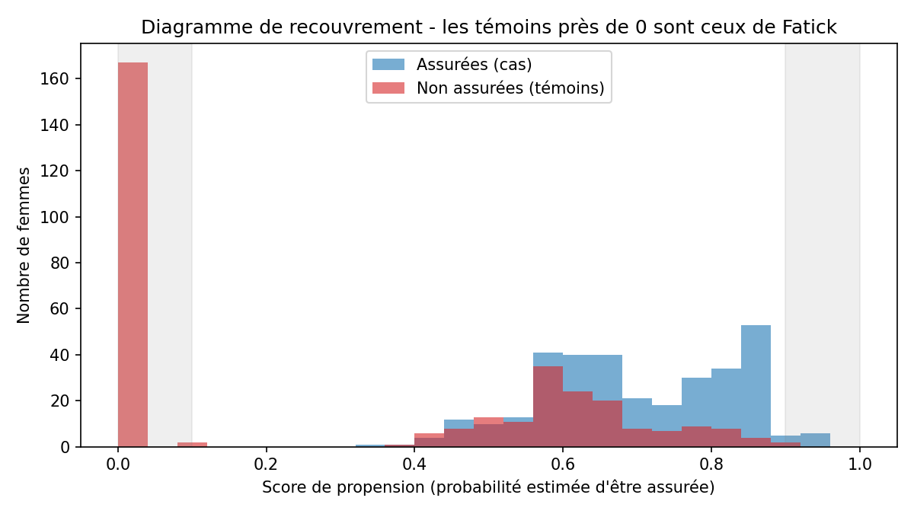
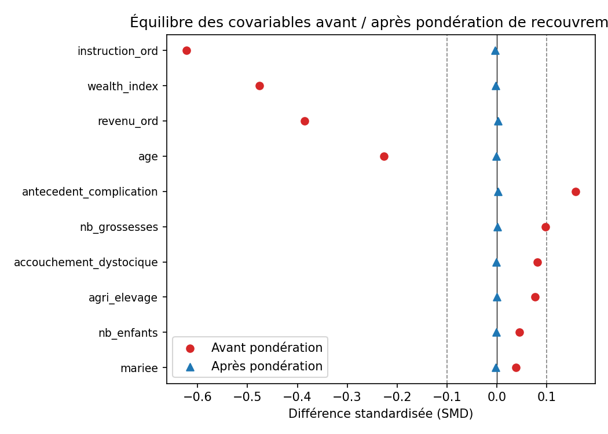
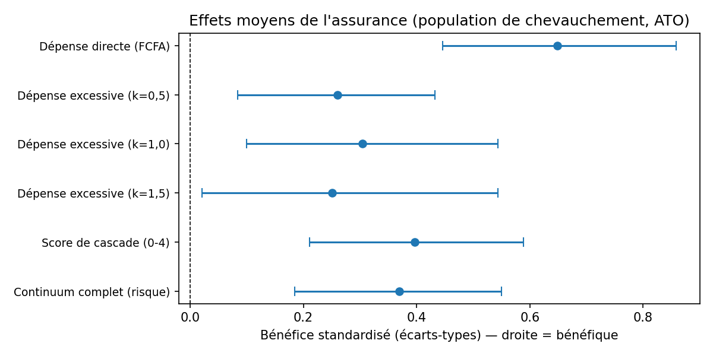
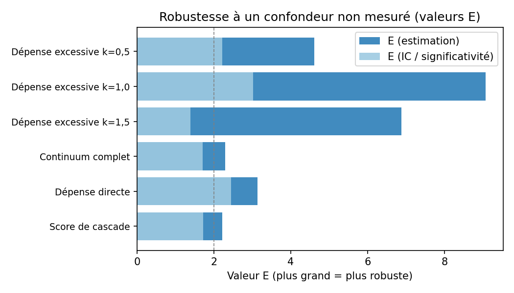
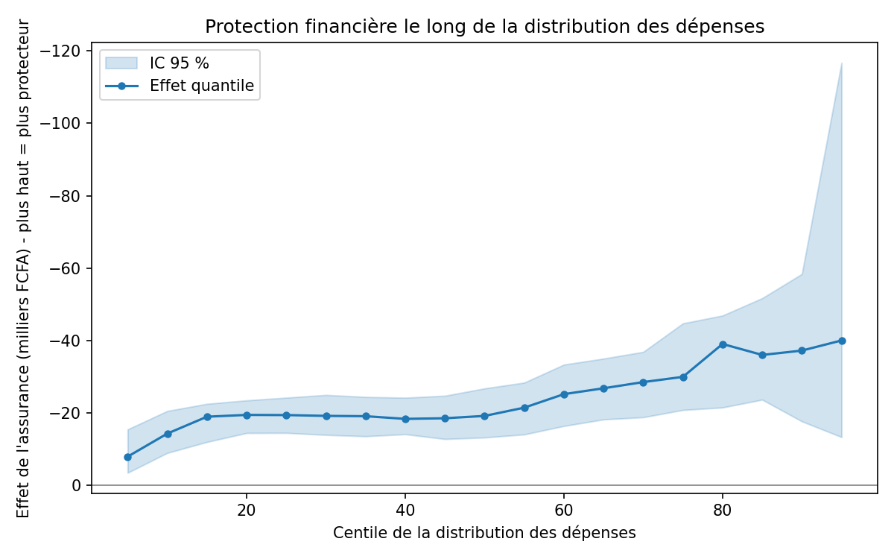
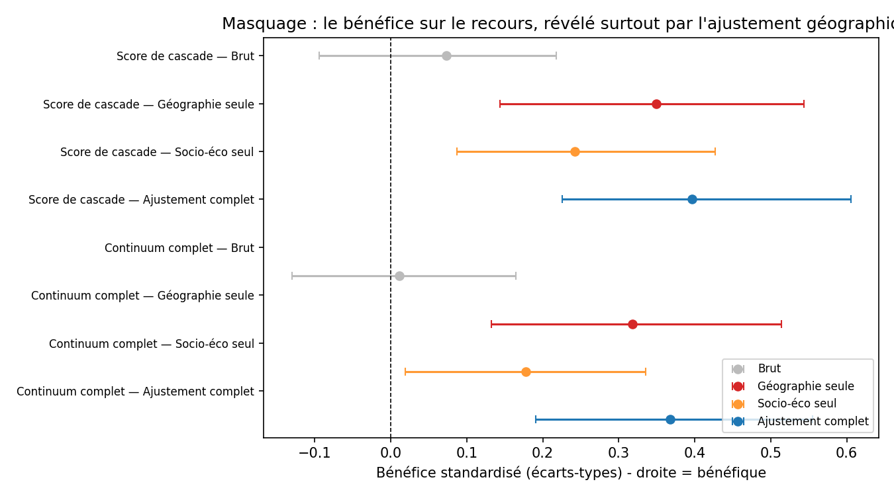

# Assurance maladie et maternité au Sénégal rural - Analyse causale des UDAM

> Impact de l'affiliation à une Unité Départementale d'Assurance Maladie (UDAM) sur la **protection financière** et le **recours aux soins** des femmes enceintes, par pondération de recouvrement (*overlap weights*).


---

## Résumé

Ce dépôt contient le pipeline d'analyse d'une étude cas-témoins (654 femmes, 3 sites) évaluant l'effet causal de l'affiliation aux UDAM. Les groupes affiliées / non affiliées n'étant pas comparables au départ (les affiliées sont plus pauvres et moins instruites), la comparaison est rendue équitable par un **score de propension** et des **poids de recouvrement**, qui gèrent aussi une violation de positivité (un site sans aucune affiliée). L'analyse mesure ensuite l'effet moyen, sa distribution, sa robustesse, et explique un bénéfice sur le recours masqué par la composition géographique.

## Principaux résultats

| Résultat | Effet (ATO) | IC 95 % | Robustesse |
|---|---|---|---|
| Dépense directe (out-of-pocket) | **-28 260 FCFA** | -37 377 ; -19 427 | élevée (valeur E = 3,1 ; Γ* = 3,45) |
| Dépense excessive (Tukey, k = 1) | **-5,5 pts** | significatif | élevée (valeur E ≈ 9) |
| Protection le long de la distribution | pente **-22 909 FCFA** (90ᵉ vs 10ᵉ) | -44 405 ; -1 998 | croissante vers la queue |
| Recours aux soins (score de cascade) | **+0,305 étape** | +0,157 ; +0,460 | suggéré (Γ* ≈ 1) |

**Deux messages :** (1) l'assurance protège surtout contre les dépenses les plus élevées ; (2) son bénéfice sur le recours, invisible en analyse brute, se révèle après traitement d'une non-comparabilité géographique.

---

## Structure du dépôt

```
.
├── README.md
├── requirements.txt
├── preparation_donnees.ipynb        # nettoyage, confondeurs, indice de richesse, résultats
├── propension_recouvrement.ipynb    # score de propension, poids, équilibre
├── effets_moyens.ipynb              # effets moyens (ATO) + bootstrap
├── sensibilite.ipynb                # valeurs E, bornes de Rosenbaum
├── effets_distributionnels.ipynb    # effets quantiles (le « bouclier »)
├── masquage.ipynb                   # décomposition + test des zones comparables
├── outputs/
│   └── figures/                            # figures (PNG 150 dpi) - voir section Figures

```

---

## Installation et reproduction

```bash
# Cloner le dépôt
git https://github.com/ousmanegithub/UDAM-Analyse-Causale.git
cd UDAM-Analyse-Causale

pip install -r requirements.txt

```

**Dépendances** (`requirements.txt`) : `pandas`, `numpy`, `scikit-learn`, `scipy`, `matplotlib`, `pyarrow`, `jupyter`, `nbconvert`.

---

## Le pipeline en bref

| Notebook | Objet | Concepts clés |
|---|---|---|
| **01** | Préparation des données | repérage par numéro de question, SMD, indice de richesse (ACP), dépense excessive (Tukey) |
| **02** | Propension & poids | régression logistique, positivité, overlap weights, taille effective |
| **03** | Effets moyens | estimand ATO, estimateur de Hájek, bootstrap avec ré-estimation des poids |
| **04** | Sensibilité | valeurs E (VanderWeele-Ding), bornes de Rosenbaum |
| **05** | Effets distributionnels | quantiles pondérés, effets quantiles, test de pente |
| **06** | Masquage | décomposition par niveau d'ajustement, test des zones à recouvrement |

---

## Tableaux (`outputs`)

| Fichier | Contenu | Rôle |
|---|---|---|
| `analytic_dataset.csv` | Jeu analytique final (654 × variables) | données de travail |
| `analytic_with_weights.csv` | Jeu + score de propension + poids de recouvrement | données de travail |
| `balance_avant_apres.csv` | SMD de chaque covariable avant / après pondération | **Tableau 1** (équilibre) |
| `effets_moyens.csv` | Effets moyens : brut, ATO, IC 95 %, ajusté | **Tableau 2** (effets) |
| `effets_quantiles.csv` | Effet à chaque centile + IC | support Figure 5 |
| `sensibilite_evalues.csv` | Valeurs E (estimation et IC) | **Tableau de sensibilité** |
| `sensibilite_rosenbaum.csv` | Bornes de Rosenbaum Γ* par résultat | **Tableau de sensibilité** |
| `masquage_decomposition.csv` | Effet par niveau d'ajustement (brut / géo / SES / complet) | support Figure 6 |

---

## Figures (`outputs/figures/`)

### Figure 1 - Diagramme de recouvrement
Distribution du score de propension des affiliées et des non affiliées. La masse de témoins proche de zéro correspond aux femmes de Fatick, sans contrepartie affiliée (violation de positivité).



### Figure 2 - Équilibre des covariables (*Love plot*)
Différence standardisée de chaque covariable avant et après pondération : tous les déséquilibres s'effondrent vers zéro (|SMD| max 0,62 -> 0,003).



### Figure 3 - Effets moyens
Effets de l'affiliation sur les résultats (dépense directe, dépenses excessives, recours), sur une échelle commune orientée « bénéfice ».



### Figure 4 - Analyse de sensibilité (valeurs E)
Robustesse de chaque effet à un facteur de confusion non mesuré. Plus la barre est longue, plus il faudrait un facteur puissant donc improbable pour effacer l'effet.



### Figure 5 - Effets distributionnels
Protection financière le long de la distribution des dépenses : l'effet (protection) croît vers la queue, où les dépenses sont les plus élevées.



### Figure 6 - Décomposition du masquage
Le bénéfice sur le recours, quasi nul en brut, réapparaît surtout dès qu'on tient compte de la géographie (site de Fatick).



---


## Données et confidentialité

Les données individuelles ne sont **pas** versionnées dans ce dépôt (protection des participantes). L'accès aux données peut être demandé aux responsables de l'étude, sous réserve des accords de confidentialité et de l'approbation éthique.

---

## Méthodologie (résumé)

- **Estimand** : effet moyen dans la population de chevauchement (ATO).
- **Identification** : score de propension (régression logistique pénalisée, incluant le site) -> poids de recouvrement (Li, Morgan & Zaslavsky, 2018).
- **Inférence** : bootstrap stratifié avec ré-estimation du score de propension à chaque réplicat.
- **Protection financière** : dépense directe (sans dénominateur) et **dépense excessive** par la méthode des valeurs aberrantes de Tukey (Ben Ameur & Ridde, 2012), le seuil étant calé sur les non affiliées.
- **Sensibilité** : valeurs E (VanderWeele & Ding, 2017) et bornes de Rosenbaum (2002).
- **Analyses complémentaires** : effets quantiles (Firpo, 2007) et décomposition du masquage géographique.

---

## Références principales

- Ameur, A.B., Ridde, V., Bado, A.R. et al. User fee exemptions and excessive household spending for normal delivery in Burkina Faso: the need for careful implementation. BMC Health Serv Res 12, 412 (2012). https://doi.org/10.1186/1472-6963-12-412
- Li, F., Morgan, K. L., & Zaslavsky, A. M. (2018). Balancing Covariates via Propensity Score Weighting. Journal of the American Statistical Association, 113(521), 390–400. https://doi.org/10.1080/01621459.2016.1260466
- Tyler J. VanderWeele, Peng Ding. Sensitivity Analysis in Observational Research: Introducing the E-Value. Ann Intern Med.2017;167:268-274. [Epub 11 July 2017]. doi:10.7326/M16-2607
- Rosenbaum PR. *Observational Studies*. 2nd ed. Springer; 2002. https://link.springer.com/book/10.1007/978-1-4757-3692-2
- Filmer, D., Pritchett, L.H. Estimating Wealth Effects Without Expenditure Data—Or Tears: An Application To Educational Enrollments In States Of India*. Demography 38, 115–132 (2001). https://doi.org/10.1353/dem.2001.0003
- Firpo S. Efficient semiparametric estimation of quantile treatment effects. *Econometrica*. 2007;75(1):259-276. https://doi.org/10.1111/j.1468-0262.2007.00738.x

---

## Auteurs

- **Pape Latyr Faye** - LDGIZC, UQAR (doctorant, auteur principal)
- **Ousmane Faye** - science des données, conception méthodologique et analyse

## Licence

Code distribué sous licence **MIT** (voir `LICENSE`). Les données ne sont pas couvertes par cette licence.
